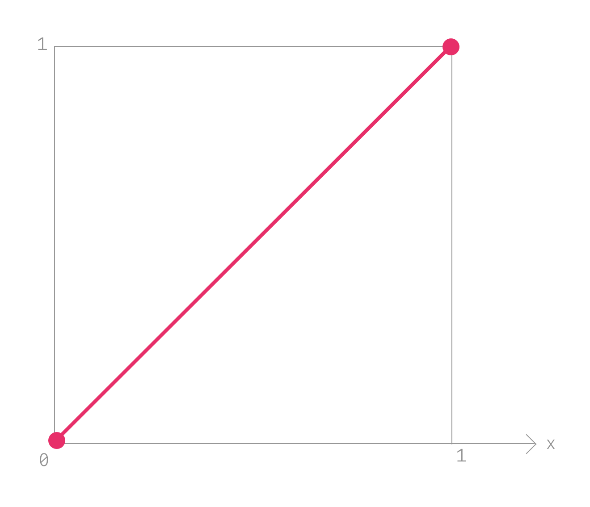
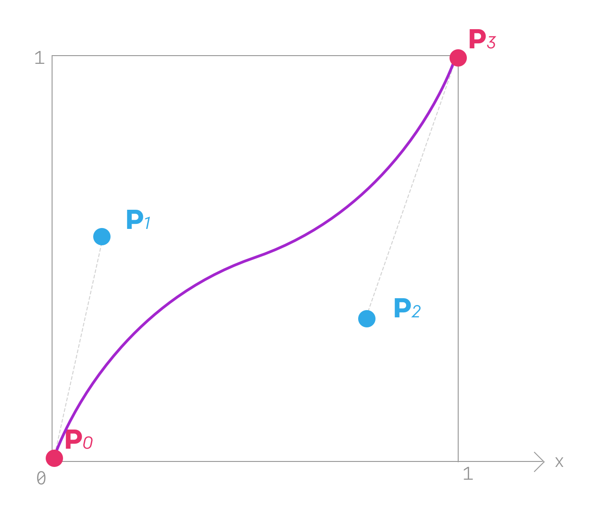

Les animations prennent une grande place dans les interfaces utilisateur. Loin
de n'apporter qu'un côté esthétique, elles augmentent la performance perçue,
améliorent notre expérience en nous aidant à nous repérer et en guidant notre
attention. Sur les applications natives, ces animations sont souvent plus
naturelles que sur le web, et pour cause, beaucoup de leurs animations sont des
_springs_.

Qu'est-ce qu'une animation _spring_ ? Pour arriver à le définir, voyons comment
on a l'habitude de créer des animations avec les technologies web.

CSS possède deux propriétés permettant d'animer des valeurs: les `animation` et
les `transition`. Au delà de la différence entre leurs capacités au sein de CSS
(propriété VS ensemble de propriétés avec des étapes), les deux reposent sur le
même mécanisme. On va donc étudier le plus simple: `transition`.

```css
.block {
  transition: 300ms linear transform;
}

.block:hover {
  transform: scale(1.05);
}
```

Cette transition est définie sur un modèle simple : on fixe une durée
d'animation (ici `300ms`) et un easing —*ou *zizine* si vous écoutez
[le podcast](http://putaindecode.io/fr/articles/podcast/1/)*— qui est une
fonction d'interpolation (ici `linear`).

L'easing est une fonction toute bête comme vous avez pu en voir au collège et
les avez dessinées sur votre calculatrice Casio ou Texas (si comme moi vous
étiez le seul péquin de la classe à avoir l'autre modèle, à devoir toujours se
démerder parce que les profs savaient pas comment la vôtre marchait).

Bref, une fonction d'easing est assez simple. Par exemple, la `linear` ça
revient à :



```js
const linear = x => x; // such complicated
// didn't even import `lodash.identity` from npm
```

Le paramètre `x` varie entre `0` et `1`, c'est la progression de l'animation. Ce
paramètre vaut `0` quand vous êtes au début de l'animation et `1` à la fin.

En faisant à la main une version du système gérant l'animation, ça donne quelque
chose dans ce style :

```js
const transition = ({ duration, easing, onUpdate, startValue, endValue }) => {
  const startDate = Date.now(); // le moment où commence l'animation
  // la fonction tick sera executée périodiquement
  const tick = () => {
    const absoluteProgress = (Date.now() - startDate) / duration; // on calcule `x`
    const progress = Math.min(absoluteProgress, 1); // on fait gaffe de pas déborder
    const progressWithEasing = easing(progress); // on applique la fonction d'easing
    // pour calculer la valeur, on diminue progressivement la valeur initiale et l'on accroit la valeur finale
    onUpdate(
      (1 - progressWithEasing) * startValue + progressWithEasing * endValue,
    );
    if (progress < 1) {
      // si c'est pas fini, on repart pour un tour
      requestAnimationFrame(tick);
    }
  };
  tick();
};

myElement.onclick = () =>
  transition({
    duration: 500,
    easing: x => x,
    onUpdate: value =>
      (myElement.style.transform = `translateY(${value + "px"})`),
    startValue: 0,
    endValue: 200,
  });
```

Pour définir cette fonction d'easing, CSS vous permet également de configurer
des courbes de Bézier cubiques.

Une courbe de Bézier cubique se définit avec 4 points : `P0`, `P1`, `P2` et
`P3`. Il en est ensuite dérivé une courbe à partir de ces quatre points. C'est
avec ce mécanisme que fonctionne la plume de la plupart des logiciels d'édition
d'image.



Vu que votre animation commence et finit à des valeurs définies à l'avance, deux
points sont fixés à l'avance : `P0` sera toujours `(0, 0)` et `P3` `(1, 1)`.

Vous avez avec CSS la liberté de définir `P1` et `P2` sous la forme
`cubic-bezier(P1x, P1y, P2x, P2y)`. Pour visualiser le fonctionnement, je vous
conseille de faire un tour sur [cubic-bezier](http://cubic-bezier.com) de
[Lea Verou](https://twitter.com/leaverou).

Tout ce que nous avons vu jusque-là sont des animations _timées_ (vive les
anglicismes). Leur durée est connue à l'avance et est immuable, les variations
possibles se feront dans les limites de ces contraintes.

Ces animations sont très pratiques pour certaines animations basiques et
rempliront très bien leur mission, mais elles peuvent rapidement avoir des
limites :

Avec CSS :

- On n'a aucun contrôle sur l'exécution de l'animation
- Configurer des animations complexes complique la maintenance

Avec un easing basique en général :

- `cubic-bezier` limite énormément les possibilités d'évolution de la valeur
  animée (e.g. on souhaite que l'animation ait de l'élasticité, les
  timing-functions ne permettent de faire qu'un seul débord qui ne parait pas
  "naturel").
- Avoir des animations cohérentes dans toute notre UI est extrêmement
  contraignant avec CSS

Pour l'élasticité, vous pouvez vous débrouiller avec `@keyframes`, hardcoder
toutes les valeurs, les _timer_ à la main, y passer des heures pour vous
retrouver avec 60 étapes dans votre animation et au final de ne pas être
satisfait du résultat, claquer la porte de votre boulot et partir élever des
brebis dans les Pyrénées.

C'est là qu'interviennent les _springs_.

Une animation spring vous expose en général deux paramètres : `tension` et
`friction` (ou `stiffness`, pour rigidité & `damping`, pour amortissement, selon
les systèmes). Ce sont des valeurs logiques dans ce contexte, puisqu'elles
viennent des lois de la physique (big up Newton).

Quelques exemples sur les
[demos de Rebound.js](http://facebook.github.io/rebound-js/examples/) peuvent
vous aider à visualiser ce que représentent ces paramètres au sein de
l'animation.

Afin d'obéir à des lois "logiques" de la physique, l'animation spring doit
prendre en compte à chaque `tick` non seulement la valeur actuelle et celle
d'arrivée mais aussi sa rapidité actuelle : c'est ce qui lui permet d'enchaîner
naturellement les animations.

À chaque frame, il va exécuter la fonction suivante pour déterminer la `value`
et `velocity` à venir (note : ce côté est une simplification du code utilisé par
[react-motion](https://github.com/chenglou/react-motion)).

```javascript
const unitOfTime = 1 / 60; // the number of seconds in a frame
const precision = 0.01;

const step = (lastValue, lastVelocity, toValue, stiffness, damping) => {
  const spring = -stiffness * (lastValue - toValue);
  const damper = -damping * lastVelocity;

  const all = spring + damper;
  const nextVelocity = lastVelocity + all * unitOfTime;
  const nextValue = lastValue + nextVelocity * unitOfTime;

  const shouldRest =
    Math.abs(nextVelocity) < precision &&
    Math.abs(nextValue - toValue) < precision;

  return {
    velocity: shouldRest ? 0 : nextVelocity,
    value: shouldRest ? toValue : nextValue,
  };
};
```

Ensuite, une simple fonction `spring` qui reproduit à peu de choses près la
mécanique de notre `createTransition` vu plus haut :

```javascript
const spring = ({
  stiffness = 180,
  damping = 12,
  onRest = () => {},
  toValue,
}) => onUpdate => {
  let frame;
  const tick = curr => {
    // on calcule l'état
    const { velocity, value } = step(
      curr.value,
      curr.velocity,
      toValue,
      stiffness,
      damping,
    );
    onUpdate({ velocity, value });
    // si l'animation n'est pas terminée
    if (velocity !== 0 || value !== toValue) {
      // on programme la prochaine frame
      frame = requestAnimationFrame(() => tick({ value, velocity }));
    } else {
      // sinon on prévient que l'animation est au repos
      onRest();
    }
  };
  return {
    // afin de permettre aux animations de s'enchaîner, la fonction `start` prend l'état actuel de la valeur
    start: value => {
      frame = requestAnimationFrame(() => tick(value));
    },
    stop: () => {
      cancelAnimationFrame(frame);
    },
  };
};
```

Il nous reste à créer une classe "observable" `Value` qui conserve l'état et
l'animation active. Cela permet de stopper l'animation en cours avant de lancer
la suivante lorsque cela arrive.

```js
class Value {
  constructor(initialValue) {
    this.value = {
      value: initialValue,
      velocity: 0,
    };
    this.listeners = new Set();
    this.animation = null;
  }
  addListener(listener) {
    this.listeners.add(listener);
    return () => {
      this.listeners.delete(listener);
    };
  }
  updateValue(nextValue) {
    this.value = nextValue;
    this.listeners.forEach(listener => listener(this.value.value));
  }
  animate(animation) {
    if (this.animation) {
      this.animation.stop();
    }
    this.animation = animation(v => this.updateValue(v));
    this.animation.start(this.value);
  }
}
```

Et voilà, vous avez une animation :

```javascript
const scale = new Value(1);

scale.addListener(value => (myElement.style.transform = `scale(${value})`));

myElement.onmousedown = () => {
  scale.animate(spring({ toValue: 2 }));
};

myElement.onmouseup = () => {
  scale.animate(spring({ toValue: 1 }));
};
```

<iframe width="100%" height="300" src="//jsfiddle.net/bloodyowl/36d0nc7r/embedded/" allowfullscreen="allowfullscreen" frameborder="0"></iframe>

Les animations spring ont de nombreux avantages. Elles vous permettent
d'utiliser un vocabulaire cohérent avec celui du mouvement. Elles vous
permettent aussi de gérer de manière intelligente le timing de vos animations :
plus besoin de _hardcoder_ le temps qu'elles doivent mettre ; seule la
description du mouvement compte. Aussi, vous n'avez plus à vous soucier des
changements de valeurs et de ses conséquences sur la cohérence globale d'une
animation : le système les gère et s'adapte.

Il existe plusieurs solutions pour les gérer :

- JS: [Rebound.js](http://facebook.github.io/rebound-js/examples/)
- JS spécifique React: [react-motion](https://github.com/chenglou/react-motion)
- JS spécifique React, utilisé par react-native:
  [Animated](https://github.com/animatedjs/animated)
- Java (Android): [Rebound](http://facebook.github.io/rebound/)
- Objective-C/Swift (iOS): [Pop](https://github.com/facebook/pop)

La team WebKit
[a également proposé](https://twitter.com/webkit/status/748573524734812161)
l'ajout d'une fonction `spring` à CSS mais la discussion stagne (à tester dans
Safari Technology Preview).

En espérant que ça vous donne des idées d'animations cool à faire.

Bisous bisous.
