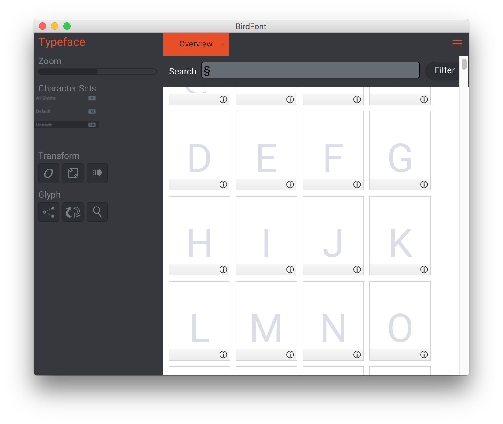
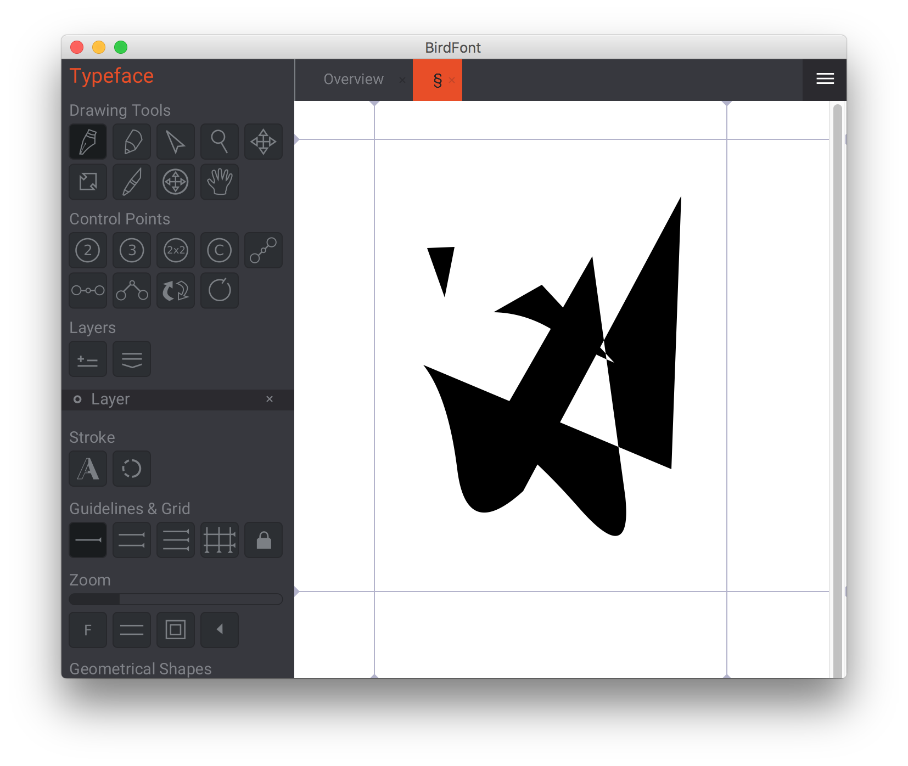

On ne va pas se mentir, la typo c'est quand même super important sur le web, et
il va falloir admettre que ce bon vieux Gutenberg avait eu un sacré flair à
l'époque.

Ah, qu'il est bon de parcourir un web parfaitement typesetté, avec de jolies
polices bien kernées et- NOPE. Au mieux une bonne grosse Arial bien crasse dans
ta face quand c'est pas de la Comic Sans MS rendue avec un crénelage moisi sous
Windows XP, #geocities.

Heureusement, le web a progressé depuis, et en tant que créateurs, nous pouvons
tous apporter notre petit morceau de plomb à l'édifice typographique avec
quelques petites astuces. Ce sont quelques unes de ces astuces que je vais vous
fournir ici, alors ouvrez bien les mirettes.

### Ampersand hacking (je suis sûr que ça ne s'appelle pas comme ça)

Pas loin d'être l'un des plus connus, il est également l'un des plus simples.

Il consiste simplement à remplacer un glyphe de votre texte par le glyphe
correspondant à ce caractère depuis une autre typo. Je m'explique.


```html
<span>
  Until the
  <span class="amp">&amp;</span>
  of time
</span>
```

```css
.amp {
  font-family: "Baskerville";
  font-style: italic
}
```

Voilà, c'est pas bien folichon mais ça fonctionne : vous pouvez dès à présent
enrouler toutes vos esperluettes (si vous êtes chef de projet, une esperluette
c'est un "et commercial") dans des `span` pour leur donner une bien chouette
gueule.

Mais ça c'est pour les quelques d'entre vous qui ont la main sur le contenu
textuel du projet, beaucoup d'autres n'ont pas ce luxe et se font fournir de
pauvres textes mal traduits servis par un vieux CMS miteux.

Ce serait chouette d'avoir un moyen pour spécifier une typo pour certains
caractères au cas par cas, non ?

Bonne nouvelle.

### Go Go Unicode-Range !

Reprenons notre exemple précédent, que nous allons implémenter avec la feature
`unicode-range` de CSS.

```html
<span>Until the &amp; of time</span>
```

```css
@font-face {
  font-family: BaskervilleAmpersand;
  font-style: italic;
  font-weight: normal;
  src: url("path/to/your/font/i'm/not/your/mother/Baskerville.eot");
  unicode-range: U+0026; /* unicode codepoint for &amp; */
}

html {
  font-family: BaskervilleAmpersand, Helvetica, Arial, Serif;
}
```

Ainsi, en tirant parti d'`unicode-range` et du stacking des polices, toutes les
esperluettes dans le corps de texte seront rendues en Baskerville et les autres
caractères tomberont en défaut sur Helvetica puis Arial, puis Serif en général.
Bon, ne me faites pas dire ce que je n'ai pas dit, cette propriété CSS n'est pas
parfaite non plus, rien que le fait de devoir aller chercher les codepoints
unicode pour retrouver le caractère à remplacer est assez lourd et fastidieux
(sauf si vous connaissez unicode par cœur mais là vous me faites peur).
L'autre possibilité si vous utilisez PostCSS, c'est le plugin
[`postcss-unicode-characters`](https://github.com/ben-eb/postcss-unicode-characters)
par [@beneb](https://github.com/ben-eb) qui simplifie grandement l'API d'unicode-range
et que je vous invite à aller voir.
Enfin, la bonne nouvelle c'est que c'est une propriété relativement bien
supportée, à partir d'IE9 vous devriez vous en tirer.


### Je suis sur IE8

(mes condoléances)
Une autre solution existe pour vous ! Il faut juste créer sa propre police et-
non sérieux revenez c'est pas si horrible, promis.
Bon, reprenons. Pour ce genre de manipulations vous aurez besoin d'un éditeur de
police, j'aime personnellement beaucoup BirdFont, qui a l'avantage d'être gratuit
et disponible sur macOS, Windows, pas mal de versions de Linux et même OpenBSD.
On entre ici dans la partie très procédurière de cet article mais mieux vaut ça
que de vous laisser seuls dans l'interface spartiate de BirdFont.


Spartiate. Bref, le bouton tout en haut à gauche, c'est le bouton "Nouvelle
police", vous pouvez cliquer dessus pour arriver à l'écran suivant.



À partir de là vous allez devoir choisir un caractère à remplacer. Ça peut être
la lettre E comme ça peut être l'emoji Pizza, personnellement j'ai décidé de
remplacer le symbole dit "paragraphe" ou "Simflouz" si vous avez joué aux Sims
(et "Sporeflouz" si vous avez joué à Spore mais passons).
Si votre caractère est un peu dur à trouver dans la liste, l'option de recherche
est faite pour ça.
Double-cliquer sur un caractère vous emmènera à l'interface d'édition.



Nous voici dans l'interface d'édition de glyphe proprement dite. Elle ne vous
dépaysera pas trop si vous avez déjà utilisé un outil de création de SVG.
N'hésitez pas à vous en donner à cœur joie si vous avez la fibre créatrice,
personnellement comme vous pouvez le voir sur la capture, je suis déjà un artiste
accompli.
Le menu hamburger en haut à droite vous permettra également d'importer directement
un SVG en tant que glyphe si vous n'avez pas la chance de dessiner aussi bien
que moi et que vous préférez déléguer ce genre de tâches à votre designer.
Ensuite, depuis le même menu hamburger, vous pourrez exporter votre typo dans
tous les formats que vous voudrez si tant est que vous vouliez les exporter en
TTF, EOT ou SVG.

De là, vous n'aurez plus qu'à importer cette font comme dans le chapitre 2 et
vous pourrez enfin rajouter "typesetter" dans vos compétences sur LinkedIn.

Vous n'avez plus qu'à trouver les utilisations les plus intéressantes de ce
genre de pratiques (il y en a plein).

La bise.
