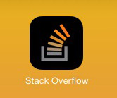
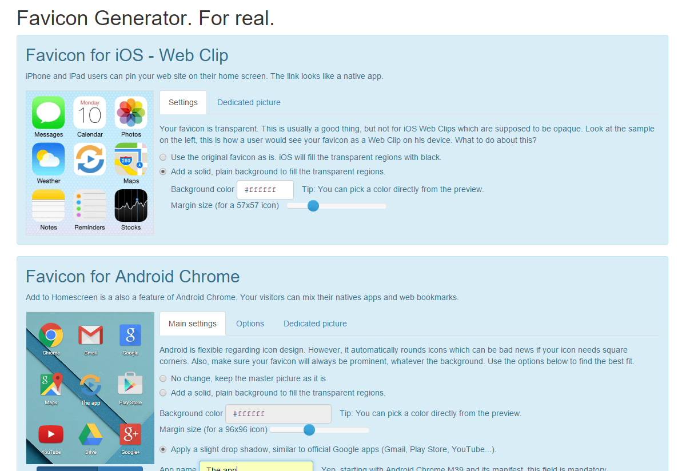

Oublions un instant CSS et JavaScript pour parler d'un sujet vraiment
important : le favicon.

Alors d'accord, le favicon n'est que le petit détail qu'on expédie en fin de
projet. Mais oubliez-le et votre client comprendra tout de suite qu'il manque
quelque chose.

Dans ce post, nous allons voir comment s'acquitter de cette tâche dans les temps
et les règles de l'art. Et nous ferons intervenir un outil dont je suis l'heureux
auteur.

## Vite fait

Pourquoi vite fait ? Parce qu'on ne peut pas consacrer trop de temps au favicon.
L'optimisation pour les smartphones, l'amélioration du score PageSpeed ou
encore l'augmentation du taux de conversion, voilà des sujets sur lesquels on
peut plancher des heures, des jours ou bien plus. Mais le favicon, franchement,
est-ce vraiment la raison à invoquer pour expliquer le retard d'un projet ? Un
détail qu'on vous dit !

Pour créer un favicon vite fait :

  - Créez un `favicon.ico` avec n'importe quel générateur trouvé sur le net.
  Déclarez-le avec `<link rel="icon" href="favicon.ico" type="image/x-icon">`.
  Ou peut-être `<link rel="shortcut icon" href="favicon.ico"
  type="image/x-icon">` ? Non parce qu'on trouve les deux. Dans le doute,
  déclarez-le deux fois.
  - Créez une Touch icon (pour iOS et les autres). Si on en croit les résultats
  pour "apple touch icon size" sur Google, la taille maximale est 144x144.

Voilà. Si vous faites tout ça, vous vous serez acquitté de la tâche rapidement.
Bon, ça sera mal fait, mais fait. C'est un début.

## Bien fait

À présent, penchons-nous sur les difficultés qui nous attendent.

### C'est la taille qui compte

Ça ne fait pas plaisir à entendre et pourtant nous sommes au cœur du problème
(nous parlons bien de favicon).

`favicon.ico` devrait-il être en 16x16 ou 32x32 ? [Les deux, selon
Microsoft](https://msdn.microsoft.com/library/gg491740(v=vs.85).aspx). Quelle
est la taille de la Touch icon d'Apple ? [180x180 depuis iOS 8](https://developer.apple.com/library/ios/documentation/UserExperience/Conceptual/MobileHIG/IconMatrix.html#//apple_ref/doc/uid/TP40006556-CH27-SW2).
La tuile `square70x70logo` pour Windows 8 et 10, c'est... du 70x70, hein ?
Moui, mais [idéalement, 128x128](https://msdn.microsoft.com/library/dn455106(v=vs.85).aspx).

Ça n'est pas tout : encore faut-il trouver ces informations. Google est
assez variable sur ce point. Il met dans le mille pour une recherche concernant
le favicon classique (16x16 *et* 32x32), mais échoue, on l'a vu, pour la
Touch icon. Les éditeurs ne sont pas en reste. Si [Apple indique bien les
dimensions attendues pour l'iPhone 6](https://developer.apple.com/library/ios/documentation/UserExperience/Conceptual/MobileHIG/IconMatrix.html#//apple_ref/doc/uid/TP40006556-CH27-SW2),
il a en revanche [oublié de mettre à jour sa page qui sort pourtant en premier résultat pour la recherche "apple touch icon"](https://developer.apple.com/library/ios/documentation/AppleApplications/Reference/SafariWebContent/ConfiguringWebApplications/ConfiguringWebApplications.html) (152x152 d'après elle).

Le [favicon cheat sheet](https://github.com/audreyr/favicon-cheat-sheet) est une
ressource intéressante à ce titre, quoique pas à jour à l'heure où ces lignes
sont écrites.

Bref, le temps de rassembler toutes ces informations et l'après-midi s'est envolé. Oups.

Ce que je décris ici est le premier problème auquel je me suis frotté il y
a un peu plus de deux ans, alors que j'achevais mon premier site responsive et
que je voulais une icône digne de ce nom.

### Le design. Vraiment.

Allez, j'ai fait dans l'anxiogène avec ces histoires de taille mais en réalité
ce problème a été largement amoindri ces derniers mois avec l'arrivée de
générateurs de favicon de nouvelle génération. Et vous en aurez pour votre
argent (d'autant qu'ils sont gratuits) : envoyez votre image et vous vous
retrouverez avec plus d'une vingtaine d'images. C'est beaucoup, presque trop
diront certains.

Mais cette solution cache un problème presque plus grave. Si votre image
originale passera bien sur une platforme, elle risque fort de ne pas
correspondre à une autre.

Prenons l'exemple des icônes pour Android et iOS. Elles servent surtout au *Add
to homescreen*, lorsque votre visiteur vous fait l'honneur d'ajouter un lien
vers votre site sur l'écran de son smartphone. Pas vraiment le moment de le
décevoir. Sur Android, beaucoup d'icônes ne sont pas carrées mais exploitent
la transparence, notamment les applications natives de Google.

Bonne idée, donc, de suivre ce principe pour notre propre icône. C'est cette
voie qu'a choisie mon cerveau auxilière, je veux parler de StackOverflow, et sa
Touch icône transparente.

Sur iOS et son univers tout de parallélépipèdes aux coins arrondis, point de
transparence en revanche. L'icône de StackOverflow se voit affublée d'un fond
noir. Le résultat n'est pas si mauvais, mais était-ce vraiment voulu ?

Passer son image à la moulinette pour en tirer une vingtaine d'icônes est une
fausse bonne idée. Elle donne la dangereuse illusion d'un travail bien fait
alors qu'en réalité vous n'avez pas de réel moyen de savoir ce que vous venez
de faire. Sauf à tester vos icônes sur différents appareils et navigateurs, mais
là ce sont encore quelques heures qui partent en fumée.

Et voilà quel était le second problème que j'ai découvert dans ma quête d'une
icône correcte. Un `-resize` d'ImageMagick et un script bash un peu brutal ne
suffisent pas.

Cela a donné le coup d'envoi à
[RealFaviconGenerator.net](https://realfavicongenerator.net/), un générateur de
favicon qui devait vraiment solutionner le problème.

Il n'y a pas grand chose à dire sur le sujet, et c'est le but: n'oublions pas
que nous n'avons que peu de temps. Rendez-vous sur RealFaviconGenerator.net,
postez votre image, éditez vos icônes plate-forme par plate-forme et vous voilà
avec ce qu'il faut d'images, de fichiers annexes et de code HTML pour
configurer votre favicon.

Voilà, c'est terminé.

### Se mettre à la page

Ou presque.

Il y a encore quelques années, il était normal de télécharger un framework
JavaScript à la main puis de le déposer tel quel dans un projet Web.
Aujourd'hui, cela est considéré comme une mauvaise pratique et on préférera
utiliser un package manager.

Est-il souhaitable d'industrialiser le favicon de la même manière ? Voyons voir
ce qu'il s'est passé en un an :

 - L'Iphone 6 est sorti, et avec lui la touch icon en 180x180 (avant c'était
 152x152).
 - Android Chrome a cessé d'utiliser l'icône en 196x196 qui était autrefois
 spécifiée. À la place, il utilise une icône en 192x192 (et snobe la précédente
 quoi qu'il arrive).
 - Oubliez cette histoire d'icône en 192x192, Android Chrome utilise désormais
 un manifeste et plusieurs versions d'icônes pour les différentes densités
 d'écran.
 - Apple a sorti une nouvelle icône au format SVG pour les "pinned tabs" de
 Safari pour Mac OS X El Capitan.

Autrement dit, si vous avez créé un favicon il y a un peu plus d'un an, il y a
fort à parier qu'il rende mal sur un iPad de dernière génération et le résultat
sur Android pourrait être assez aléatoire (Chrome utilisera une icône PNG qui
n'est pas pour lui ou bien une Touch icon).

À cet effet,
[RealFaviconGenerator propose une API](https://realfavicongenerator.net/api).
Tout ce qu'il est possible de faire via l'UI peut être reproduit via l'API.
Hum... une API... de la doc à lire... Manifestement, ce n'est pas de cette
façon qu'on va accélérer les choses. Mais tout n'est pas perdu car le code peut
être généré automatiquement.

Actuellement, RealFaviconGenerator supporte Grunt et Gulp. Par exemple, après
avoir créé votre favicon, cliquez sur l'onglet "Gulp". Vous avez le fragment de
Gulpfile ainsi que les instructions pour intégrer votre favicon à votre
processus de build, au même titre que la minification des CSS ou le processing
des Coffee scripts.

Les règles :

 - `generate-favicon` : génère les icônes. Elle prend quelques
 secondes et c'est le genre de règle qu'on n'exécute qu'une fois de temps en
 temps, lorsqu'il y a du changement dans le paysage des favicons.
 - `inject-favicon-markups` : injecte les déclarations d'icônes
 dans les pages HTML. À exécuter à chaque modification de page, autant dire
 qu'elle va souvent servir.
 - `check-for-favicon-update` : vérifie s'il y a du nouveau sur
 RealFaviconGenerator. Si c'est le cas, elle fera échouer votre build bien
 comme il faut. Un peu brutal mais ça a le mérite d'être clair. Si vous
 avez un système d'intégration continue, arrangez-vous pour ajouter cette règle
 à votre radar.

La favicon a toujours été un parent pauvre des projets web, à juste titre.
Avec la prolifération des plates-formes, le négliger est de plus en plus hasardeux.
J'ai conçu RealFaviconGenerator pour apporter un peu d'ordre à tout cela. Ce
n'est pas la seule initiative. Hayden Bleasel développe
[favicons](https://github.com/haydenbleasel/favicons) qui ambitionne d'être
[intégré au Web Starter Kit de Google](https://github.com/google/web-starter-kit/issues/599).

Et maintenant, c'est à vous : que pensez-vous de la formule "génération de
Gulp/Grunt/autre" ? Quelles sont les technos que vous aimeriez trouver ?
