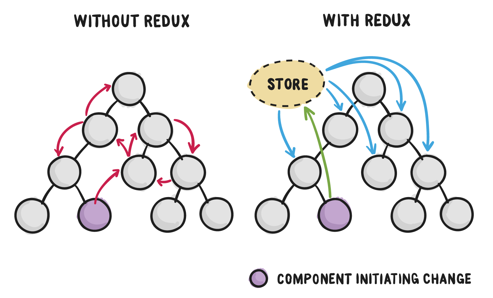

# 2 ans de React !

Depuis fin 2014, et un virage radical vers l'ecosystème React, j'ai eu l'occasion de mener plusieurs projets (Applis pros, mobiles/hybrides, site webs...) sur cette stack : ReactJS, Webpack, Babel, npm...

Ces deux années ont été très prolifiques dans la communauté javascript et React, le tooling est encore parfois exotique, mais il se stabilise et de gros progrès ont été faits sur la documentation.

**Nous disposons maintenant d'un ecosystème incroyablement riche et dynamique, et d'un paradigme "universel" pour construire les applications de demain, web ou natives.**

React est la librairie de facto pour ce type d'applications, mais on peut le remplacer assez facilement par une alternative comme [preact](https://preactjs.com/) ou [inferno](http://infernojs.org/), donc toutes les connaissances acquises sur cette librairie **et son ecosystème** sont exploitables ailleurs dans la communauté javascript.

Voici un petit recap de cette stack magique :)

## TL; DR;

React en lui-même est simple à appréhender;

Son écosystème, riche et évolutif, l'est moins.

## Babel/ES6


### Use next generation JavaScript, today.

La communauté Javascript a massivement adopté le transpileur Babel, qui permet de coder en javascript version ES6 ou supérieure puis de convertir en code compatible avec les navigateurs du marché.

Pour apprendre ES6 et plus :
  - [Articles sur putaindecode.io](http://putaindecode.io/fr/tag/ES6)
  - Exercices en ligne : [es6katas.org](http://es6katas.org)
  - Comparaisons ES5/ES6 : [es6-features.org](http://es6-features.org/#BlockScopedVariables)

Vous pouvez très bien faire de l'ES6 sans Babel, puisque [les navigateurs modernes en supportent une grande partie](https://kangax.github.io/compat-table/es6/), mais le support est inégal, d'ou l'idée d'utiliser un transpileur comme babel qui convertit en ES5.

Le format JSX, qui permet de manipuler les "templates" depuis le javascript est également un standard qui simplifie grandement le développement et impose une rigueur bénéfique. Ca peut être déroutant les 30 premières minutes :)

cf [Introducing JSX](https://facebook.github.io/react/docs/introducing-jsx.html)

## npm


Quel que soit votre besoin, il y à déjà un module npm pour ça :)

Pour bien choisir ses packages :

 - utilisez [npms.io](http://npms.io) pour rechercher
 - regardez l'activité du projet sur github (commits, issues, tests, contributeurs...)

### Moins de code c'est moins de bugs

Votre appli doit utiliser un maximum de code externe, qui est déjà validé, testé... séparement. Publiez un maximum de modules indépendants, en open source si possible, et utilisables hors-contexte ([FIRST principle](https://addyosmani.com/first/)).


## Webpack


### Le saviez-vous ?

Webpack a coûté aux devs **2.312.533 heures** en 2015. par jour.

### Un grand pouvoir implique de grandes responsabilités

Webpack est puissant, il remplace tous les grunt, gulp, blurp...

À partir de votre fichier `index.js` uniquement, il est capable de servir et bundler toutes les dépendances (code, images, css...) de votre projet automatiquement, grâce aux nombreux [loaders](https://webpack.github.io/docs/loaders.html).

Pour cela, les assets doivent être correctement déclarés dans le code :

```js
// require some CSS
import styles from './styles.css'
const ex1 = <div className={ styles.title }>title</div>

// require an image
import logo from './logo.png'
const img = 
```

Et la célèbre [conf de webpack](https://webpack.github.io/docs/configuration.html) permet de tuner votre build à tous les niveaux.

cf [putaindecode/intro-webpack](http://putaindecode.io/fr/articles/js/webpack/premier-exemple/)

## CSS


### Le saviez-vous ?

Le CSS est un sport de haut niveau.

### CSS in 2016

Le CSS est sûrement ce qui prend le plus le temps sur une application qui doit gérer du responsive, des animations, et suivre des designs précis.

Et la qualité et la modularité du CSS est essentielle pour la maintenabilité des applications;

Pour créer des composants réutilisables nous pouvons maintenant utiliser les [CSS modules](https://github.com/css-modules/css-modules), qui ont l'avantage d'être du CSS classique, mais d'être scopé aux composants, et, accessible depuis le javascript (plus de css global); Et le [CSS in JS](https://youtu.be/WyFGfMFjfH4?t=26m23s) peut compléter/remplacer si besoin pour les cas les plus dynamiques.

Il existe plusieurs librairies de composants UI assez fournies pour React :

 - [ant.design](http://ant.design)
 - [semantic-ui](http://semantic-ui.com)
 - [material-ui](https://github.com/callemall/material-ui)
 - [blueprintjs](http://blueprintjs.com)

## React : Learn once, run everywhere


Plus qu'une librairie ou un framework, React est un paradigme de programmation d'interfaces utilisateurs, qui permet d'adresser de nombreuses plateformes, avec toujours du code React "standard".

Théoriquement, une application codée en React est capable de produire n'importe quel output, par exemple du HTML pour le web, du natif avec [react-native](https://facebook.github.io/react-native/), du [WebGL](https://github.com/ProjectSeptemberInc/gl-react), du [terminal](https://github.com/Yomguithereal/react-blessed), de la [musique](https://github.com/FormidableLabs/react-music)...

Et pour toutes ces targets, une convention générale s'applique :

<div style="font-size:2em;line-height:2em;font-style:italic;color:#222">ui = f(state)</div>

A tout moment, à partir un `state` donné, une application ou un composant React est capable de se "render" correctement dans l'état désiré.

Le fonctionnement interne est donc plutôt straightforward, les composants se passent simplement des `props` (valeurs et callbacks) de parent à enfant, et certains composants peuvent avoir un `state` local qui, une fois modifié, déclenchera son re-render, ainsi que celui de ses enfants, en optimisant les performances grâce au virtual-dom.

Les composants doivent être simples, focus, composables.

```jsx
<Toolbar>
  <Icon name="sucess" onClick={ onClickSuccess } />
  <Menu>
    <Icon name="warning" onClick={ onClickWarning } />
    <Icon name="error" onClick={ onClickError } />
  </Menu>
</Toolbar>
```

- http://putaindecode.io/fr/tag/react/

## Redux

[](https://css-tricks.com/learning-react-redux/)

Pour les applications plus complexes, [redux](http://reduxjs.org) va gèrer l'état de l'application de manière globale et externe aux composants, standardiser les évènements (actions), gérer les re-renders, et permettre d'aller vers des [interactions plus avancées](https://github.com/markerikson/redux-ecosystem-links).

Idéalement, [tous vos composants sont dumbs](https://medium.com/@dan_abramov/smart-and-dumb-components-7ca2f9a7c7d0#.j9rp2pr98) et votre gestionnaire de state (par exemple redux) va gérer l'intelligence de l'application et les re-renders de manière découplée et optimisée.

 - http://putaindecode.io/fr/tag/redux/

## Tips

### Storybook 

Utiliser un outil comme [storybook](https://github.com/storybooks/react-storybook) permet de travailler sur les composants hors-contexte, de pouvoir les visualiser dans différents états pendant que vous travaillez... et ainsi d'avoir une base saine de composants réutilisables.

Votre bibliothèque de composants peut même être un projet à part, que vous importez dans vos différentes applications. ex : https://github.com/cloudflare/cf-ui

### Composition

Utilisez au maximum la composition de composants React pour garder des composants simples et réutilisables. http://putaindecode.io/fr/articles/js/react/higher-order-component/

### nvm

Utilisez [Node Version Manager](https://github.com/creationix/nvm) aka nvm  qui permet de gérer plusieurs environnements NodeJS sur une même machine. Indispensable pour travailler sur plusieurs projets.

### Learning curve

Concentrez-vous sur une techno/outil à la fois et n'utilisez pas ce dont vous n'avez pas encore besoin.

> make it work, make it right, make it fast

## Comment démarrer ?

Pour créer une application, le plus simple est d'utiliser [create-react-app](https://github.com/facebookincubator/create-react-app).

Si c'est pour créer un composant react que vous allez publier, alors [nwb](https://github.com/insin/nwb) est plus adapté.

Pour créer un site web comme [putaindecode.io](http://putaindecode.io) vous pouvez utiliser un générateur de site statique comme [phenomic.io](http://phenomic.io).

## Pourquoi c'est si compliqué ?

Cette stack, qui peut paraitre lourde en outillage, permet de créer des apps riches, performantes, testables, évolutives, multi-plateformes.

ES6 et react en eux-mêmes ne sont pas compliqués et simplifient au contraire le code et le workflow de développement.

Une fois l'outillage en place et assimilé, la productivité est excellente (es6, npm, tests, developer experience, dev/build/deploy...).

## Must read

 - [Intro to React](https://facebook.github.io/react/tutorial/tutorial.html)
 - free videos [egghead.io/react-fundamentals](https://egghead.io/courses/react-fundamentals)
 - free videos [egghead.io/getting-started-with-redux](https://egghead.io/courses/getting-started-with-redux)
 - [You might not need redux](https://medium.com/@dan_abramov/you-might-not-need-redux-be46360cf367#.8swndjba2)
 - [Smart VS dumb components](https://medium.com/@dan_abramov/smart-and-dumb-components-7ca2f9a7c7d0#.v583rvea1)
 - [Les patterns Provider & Higher-Order Component avec React](http://putaindecode.io/fr/articles/js/react/higher-order-component/)
 - [React higher components in depth](https://medium.com/@franleplant/react-higher-order-components-in-depth-cf9032ee6c3e#.t74wxicu0)

## Liens

> quelques pépites

 - [create-react-app](https://github.com/facebookincubator/create-react-app) : CLI complet pour faire une application react
 - [nwb](https://github.com/insin/nwb) : CLI complet faire un composant react (dev,build,demo,tests,npm...)
 - [react-css-components](https://github.com/andreypopp/react-css-components) : créer des composants React à partir de CSS
 - [redux-ecosystem-links](https://github.com/markerikson/redux-ecosystem-links)
 - [npm scripts docs](https://docs.npmjs.com/misc/scripts)
 - [aframe-react](https://github.com/ngokevin/aframe-react) : Build VR experiences with A-Frame and React
 - [phenomic.io](http://phenomic.io) : react-based static site generator
 - [jsbooks.revolunet.com](http://jsbooks.revolunet.com) : free javascript ebooks


