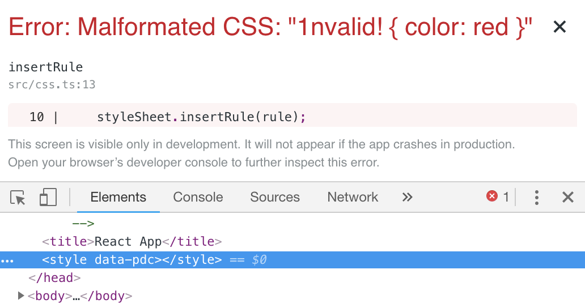
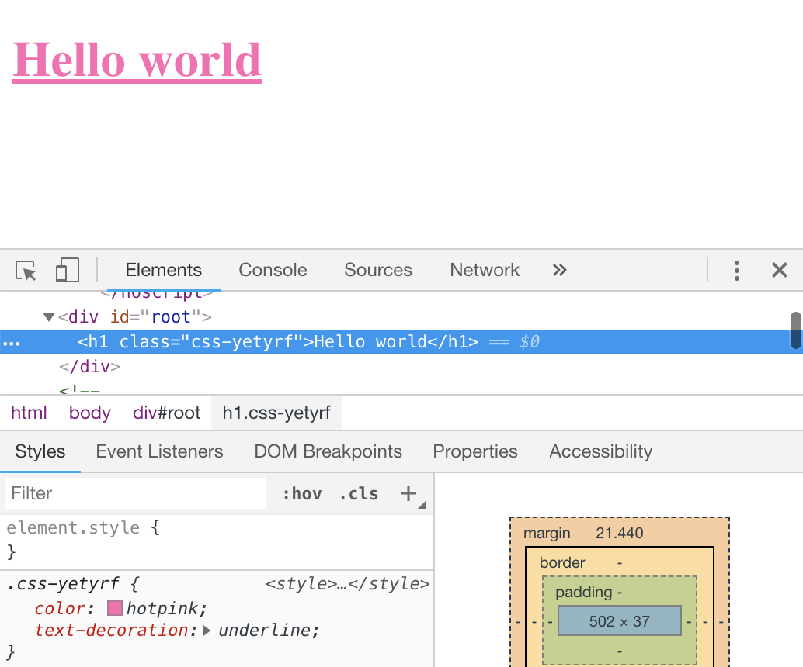
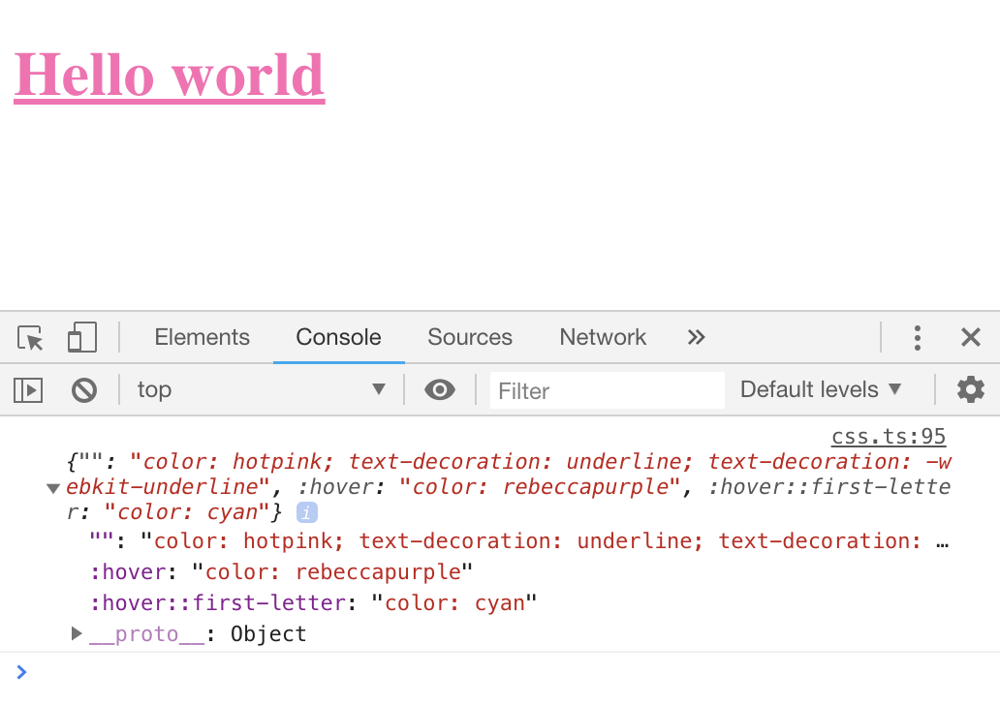
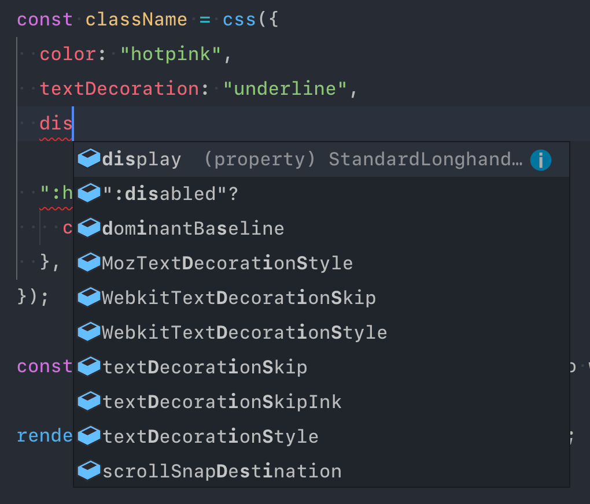
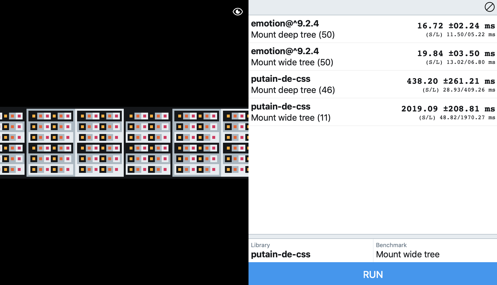
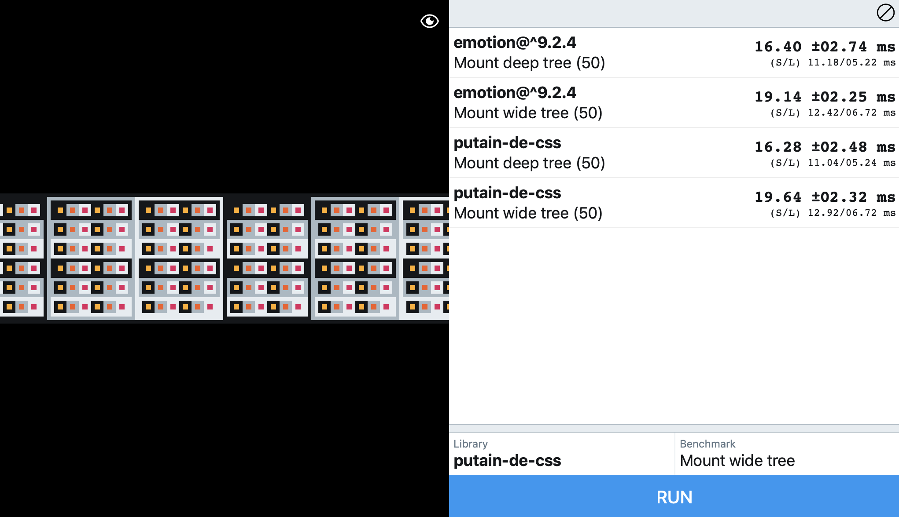
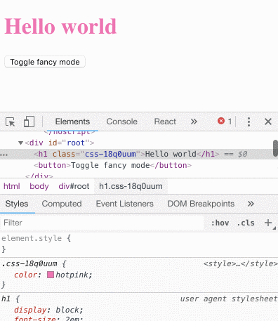

Il se peut que vous entendiez beaucoup parler de CSS-in-JS dernièrement (oui,
encore). C'est un sujet de polémique bien connu dans le milieu du front-end
actuel: les argumentaires tournent en boucle, souvent biaisés par les habitudes
de chaque partie.

Histoire de comprendre un peu ce qu'est le CSS-in-JS **avant** de continuer à
taper notre voisin en lui expliquant pourquoi c'est bien / pas bien, nous allons
réaliser une petite lib qui fait les basiques (insertion de style, gestion des
pseudo-classes / pseudo-elements, un moyen de gérer le responsive).

## Initialisation du projet

Pour plus de sécurité et de confort, nous allons utiliser
[TypeScript](http://www.typescriptlang.org). Copiez / collez la commande
suivante pour créer et lancer un nouveau projet sobrement intitulé
`putain-de-css`.

```sh
npx create-react-app putain-de-css \
  && cd putain-de-css \
  && npm i -D typescript \
  && npm i -S @types/node @types/react-dom @types/react \
  && rm -rf src && mkdir src \
  && echo \
'import * as React from "react";
import { render } from "react-dom";

const App = () => <h1>Hello world</h1>;
render(<App />, document.getElementById("root"));' \
> src/index.tsx \
  && npm start
```

Ouvrez votre éditeur de code préféré, on attaque directement en créant un
nouveau fichier `src/css.ts`.

## Insertion de style sous la forme de string

La première chose à faire pour pouvoir insérer des styles au sein du CSSOM,
c'est de créer un élément DOM `<style>` dans le `<head>` de notre document, et
de récupérer l'objet de type `CSSStyleSheet` qui lui est attaché.

```js
// src/css.ts

const styleEl = document.createElement("style");
styleEl.appendChild(document.createTextNode(""));
document.head.appendChild(styleEl);

const sheet = styleEl.sheet as CSSStyleSheet;
```

À la suite, nous allons créer une fonction simple qui insère une règle CSS, et
nous prévient des règles malformées en développement (pour rappel, une règle est
constituée de la façon suivante:
`selector { property: value; property: value; … }`).

```js
// src/css.ts
// …

export function insertRule(rule: string) {
  try {
    sheet.insertRule(rule);
  } catch (error) {
    if (process.env.NODE_ENV !== "production") {
      throw new Error(`Malformated CSS: "${rule}"`);
    }
  }
}
```

Nous pouvons dès à présent importer cette fonction au sein de notre fichier
`index.tsx` et tenter plusieurs essais.

```js
// src/index.tsx
// …

import { insertRule } from "./css";

// testons d'abord:
insertRule("h1 { color: hotpink }");
// puis:
insertRule("1nvalid! { color: red }");

const App = () => <h1>Hello world</h1>;

// …
```

<figure>
  
  <figcaption>Quand tout va bien</figcaption>
</figure>

<figure>
  
  <figcaption>Quand tu tapes n'importe quoi</figcaption>
</figure>

## Insertion de style sous la forme d'objets

Écrire toutes nos règles sous forme de string, ça va 5 minutes. Il nous est
toujours possible de faire ce que l'on veut (et donc souvent n'importe quoi) de
nos sélecteurs. Nous allons donc créer une fonction supplémentaire pour
transformer un objet en règle insérable et dont le sélecteur sera un nom de
classe généré et unique.

Nous allons également créer quelques types assez basiques en haut de notre
fichier.

```js
// src/css.ts

// "Value" peut être de type string OU number
type Value = string | number;

// "Style" est un objet dont les valeurs sont de type Value
export type Style = {
  [name: string]: Value,
};

// …

export function insertStyle(style: Style) {
  const content = Object.keys(style)
    .map(name => `${name}: ${style[name]}`)
    .join("; ");

  insertRule(`h1 { ${content} }`);
}
```

À ce point, vous pouvez importer `insertStyle` et vous en servir, vous
constaterez que cela a l'effet escompté… sur notre `h1` pour le moment.

```js
// src/index.tsx
// …

import { insertStyle } from "./css";

insertStyle({
  color: "hotpink",
  "text-decoration": "underline",
});

// …
```

<figure>
  
</figure>

Afin de créer un nom de classe unique, il nous faut "hasher" notre règle CSS.
Comme la librairie souhaitée n'est pas disponible sur `npm`, nous sommes obligés
de copier l'implémentation de `murmurhash2` par **@garycourt**.
[Récupérez le fichier ici](https://github.com/garycourt/murmurhash-js/blob/master/murmurhash2_gc.js),
sauvegardez le sous le nom `src/hash.ts`.

De base, la fonction prend en paramètre un `seed` (que nous souhaitons être
toujours le même) et retourne un `integer`. Nous allons donc l'adapter un peu.

```js
// src/hash.hs
/* eslint-disable */

// on change la signature de la fonction
export default function hash(str: string) {
  var l = str.length,
    h = 1 ^ l, // on hardcode la valeur de seed

  // …

  // on retourne un string encodé depuis la base 36
  return (h >>> 0).toString(36);
}
```

Nous pouvons dès à présent générer un nom de classe en fonction du contenu de
notre règle CSS.

```js
// src/css.ts

import hash from "./hash";

// …

export function insertStyle(style: Style) {
  const content = Object.keys(style)
    .map(name => `${name}: ${style[name]}`)
    .join("; ");

  const className = "css-" + hash(content);
  insertRule(`.${className} { ${content} }`);

  return className;
}
```

Et même l'appliquer sur notre composant React / élément HTML / ce que vous
voulez !

```js
// src/index.tsx
// …

import { insertStyle } from "./css";

const className = insertStyle({
  color: "hotpink",
  "text-decoration": "underline",
});

// on applique la classe créée
const App = () => <h1 className={className}>Hello world</h1>;
```

<figure>
  
</figure>

## Propriétés en lowerCamelCase

Créons une nouvelle fonction juste avant `insertStyle`. Celle-ci va remplacer
toutes les majuscules de notre paramètre de type `string` par un hyphen + sa
minuscule.

Elle gère également le cas un peu spécial des préfixes Microsoft (qui ne
commencent pas par une majuscule, contrairement à ceux de Mozilla / Webkit).

```js
// src/css.ts
// …

// expected outputs:
// fontFamily -> font-family
// MozTransform -> -moz-transform
// msTransform -> -ms-transform
// WebkitTransform -> -webkit-transform

function hyphenateName(name: string) {
  return name
    .replace(/([A-Z])/g, (_, letter) => `-${letter.toLowerCase()}`)
    .replace(/^ms-/, "-ms-");
}

export function insertStyle(style: Style) {
  const content = Object.keys(style)
    // on ajoute l'hyphenation du nom ici
    .map(name => `${hyphenateName(name.trim())}: ${style[name]}`)
    .join("; ");

  const className = "css-" + hash(content);
  insertRule(`.${className} { ${content} }`);

  return className;
}
```

En modifiant notre appel à `insertStyle` dans `index.tsx`, on s'aperçoit que
tout fonctionne comme espéré.

```js
// src/index.tsx
// …

const className = insertStyle({
  color: "hotpink",
  textDecoration: "underline", // plus d'hyphens!
});

//…
```

## Gestion des valeurs de fallback

Parce qu'en CSS il est possible de faire:

```css
display: -webkit-flex;
display: -moz-flex;
display: flex;
```

Mais que la nature des objets JavaScript ne nous le permet pas (impossible
d'avoir plusieurs clés identiques), il nous faut pouvoir prendre un tableau en
valeur.

```js
// src/css.ts
//…

// on commence par modifier le type Value
type Value = string | number | Array<string | number>;

// …

// on externalise la "cssification" en 2 fonctions

// cssifyDeclaration retourne "nom: valeur" si la valeur est correcte
function cssifyDeclaration(name: string, value: any) {
  if (
    (typeof value === "string" && value !== "") ||
    (typeof value === "number" && isFinite(value))
  ) {
    return `${name}: ${(value + "").trim()}`;
  }
}

// compactDeclarations filtre les falsy values et compacte le reste avec "; "
function compactDeclarations(declarations: (string | undefined)[]) {
  return declarations.filter(declaration => !!declaration).join("; ");
}

export function insertStyle(style: Style) {
  const declarations = Object.keys(style).map(name => {
    const hName = hyphenateName(name).trim();
    const value = style[name];

    return Array.isArray(value)
      ? compactDeclarations(value.map(fbv => cssifyDeclaration(hName, fbv)))
      : cssifyDeclaration(hName, value);
  });

  const content = compactDeclarations(declarations);
  const className = "css-" + hash(content);
  insertRule(`.${className} { ${content} }`);

  return className;
}
```

Si l'on modifie le style appliqué sur notre `<h1>` de cette façon:

```js
// src/index.tsx
// …

const className = insertStyle({
  color: "hotpink",
  textDecoration: "underline",
  display: ["-webkit-flex", "-moz-flex", "flex"],
});

// …
```

On constate que le navigateur ne nous indique pas que 3 valeurs ont été insérées
(en barrant celle qui ne sont pas appliquées).

<figure>
  
</figure>

En effet, lorsque vous utilisez `insertRule`, seule la dernière valeur comprise
par le navigateur est réellement insérée. Ainsi, si on change la valeur de
`display` pour `["flex", "-webkit-flex", "-moz-flex"]`, vous verrez que seul
`-webkit-flex` sera appliqué (si bien sûr vous utilisez un navigateur qui
comprends les préfixes webkit mais pas les préfixes mozilla).

## Gestion des pseudo-classes / éléments

L'idée c'est de les déclarer directement au sein de notre déclaration de style,
si possible de façon infiniment nestés.

On modifie donc l'exemple pour visualiser le but à atteindre:

```js
// src/index.tsx
// …

const className = insertStyle({
  color: "hotpink",
  textDecoration: "underline",

  ":hover": {
    color: "rebeccapurple",

    "::first-letter": {
      color: "cyan",
    },
  },
});

// …
```

Idéalement, il nous faudrait une fonction qui aplatisse ce style par suffixe
appliqué à notre classe, de cette façon:

```js
{
  "": "color: pink; text-decoration: underline",
  ":hover": "color: rebeccapurple",
  ":hover::first-letter": "color: cyan",
};
```

```js
// src/css.ts
// …

// on modifie le type Style
export type Style = {
  [name: string]: Value | Style,
};

function isPlainObject(value: any) {
  return Object.prototype.toString.call(value) === "[object Object]";
}

function flattenStyle(style: Style, suffix: string = "") {
  let result: { [suffix: string]: string | undefined } = {
    // on s'assure que le sélecteur "racine" est le premier inséré
    [suffix]: undefined,
  };

  // on extrait la logique qui était précedemment dans insertStyle
  const declarations = Object.keys(style).map(name => {
    const value = style[name];

    if (isPlainObject(value)) {
      if (process.env.NODE_ENV !== "production") {
        // on peaufine un peu la DX (et on évite quelques edge-cases)
        if (!/^::?(-webkit-|-moz-|-ms-)?[a-z][a-z-]+(\(.+\))?$/.test(name)) {
          throw new Error(`Invalid pseudo class / element: "${name}"`);
        }
      }

      const nested = flattenStyle(value as Style, `${suffix}${name}`);

      Object.keys(nested).forEach(nName => {
        result[nName] = nested[nName];
      });
    } else {

      const hName = hyphenateName(name).trim();

      return Array.isArray(value)
        ? compactDeclarations(value.map(fbv => cssifyDeclaration(hName, fbv)))
        : cssifyDeclaration(hName, value);
    }
  });

  result[suffix] = compactDeclarations(declarations);
  return result;
}
```

Si on passe notre style dans cette fonction `flattenStyle` afin d'en analyser la
sortie, on constate qu'elle fait exactement ce que l'on souhaite.

<figure>
  
</figure>

Il ne nous reste qu'à hasher la représentation de cet objet et insérer les
règles une par une.

```js
// src/css.ts
// …

export function insertStyle(style: Style) {
  const flattened = flattenStyle(style);
  const className = "css-" + hash(JSON.stringify(flattened));

  Object.keys(flattened).forEach(suffix => {
    insertRule(`.${className}${suffix} { ${flattened[suffix]} }`);
  });

  return className;
}
```

<figure>
  
</figure>

## Concaténation de styles

Une pratique assez répandue est d'appliquer conditionnellement plusieurs objets
styles en fonction de l'état de nos composants.

```js
// ce genre de chose
css(styles.base, this.props.disabled && styles.disabled);
```

Supprimez tous les exports de fonction du fichier `css.ts`, nous n'allons en
garder qu'un seul, celui par défaut: cette fameuse fonction `css`!

```js
// src/css.ts
// …

export type MaybeStyle = Style | false | null | undefined;

// …

// renommez la fonction ìnsertStyle
// elle accepte à présent des styles, mais aussi des "falsy values"
function css(...styles: MaybeStyle[]) {
  const flattened = styles
    // on ne garde que les objets
    .filter(style => isPlainObject(style))
    .map(style => flattenStyle(style))
    .reduce((flat, style) => {
      Object.keys(style).forEach(suffix => {
        flat[suffix] = flat[suffix]
          ? `${flat[suffix]}; ${style[suffix]}`
          : style[suffix];
      });
      return flat;
    }, {});

  const className = "css-" + hash(JSON.stringify(flattened));

  Object.keys(flattened).forEach(suffix => {
    insertRule(`.${className}${suffix} { ${flattened[suffix]} }`);
  });

  return className;
}
```

Je vous laisse ça afin de faire un test rapide:

```js
// src/index.tsx
// …

import css from "./css";

const className = css(
  {
    color: "hotpink",
    textDecoration: "underline",

    ":hover": {
      color: "rebeccapurple",
    },
  },
  {
    color: "red",

    ":hover": {
      color: "blue",
    },
  },
);

// …
```

## Autoprefixing

Il est temps de peaufiner un peu l'expérience de développement. Si je vous dit
qu'on a implémenté toutes les features nécessaires pour utiliser l'équivalent
d'un autoprefixer (qui préfixe automatiquatiquement les propriétés pour un
meilleur support navigateur)?

Il s'agit d'[inline-style-prefixer](https://inline-style-prefixer.js.org).

```sh
npm i -S inline-style-prefixer @types/inline-style-prefixer
```

```js
// src/css.ts

import { prefix } from "inline-style-prefixer";

// …

function css(...styles: Style[]) {
  const flattened = styles
    .filter(style => isPlainObject(style))
    // on ajoute l'appel ici
    .map(style => flattenStyle(prefix(style) as Style))
    // …
```

Et c'est tout! 😀

## Autocomplétion

Le CSS-in-JS, ça peut vous rebuter quand on voit le tooling actuellement
disponible pour le CSS. L'autocomplétion dans les éditeurs de texte est quali,
ça serait bien d'avoir quelque chose de similaire…ça tombe bien, nous utilisons
un langage typé.

```sh
npm i -S csstype
```

```js
// src/css.ts

import { PropertiesFallback, SimplePseudos } from "csstype";

//…

// remplacez Style par ceci
export type Style = PropertiesFallback &
  { [pseudo in SimplePseudos]?: PropertiesFallback };

// on en profite pour ajouter un type StyleSheet
export type StyleSheet = { [key: string]: Style };

// …
function flattenStyle(style: Style, suffix: string = "") {
  let result: { [suffix: string]: string | undefined } = {
    [suffix]: undefined,
  };

  const declarations = Object.keys(style).map(name => {
    const value = (style as any)[name] as Value; // on force le type ici
    // …
```

<figure>
  
</figure>

## Performances

Comme vous vous en doutez, pour le moment notre lib n'est pas un foudre de
guerre: aucun système de cache n'est présent. Comme on désire tout de même
briller dans les benchmarks, tâchons d'optimiser ça.

Pour cela on va utiliser la mémoïsation, et commencer par créer un nouveau
fichier `memoize.ts`.

```js
// src/memoize.ts

export default function memoize<T extends (...args: any[]) => any>(
  fn: T,
  resolver: (...args: any[]) => any = value => value,
): T {
  const cache: {
    [key: string]: any;
  } = {};

  const internalFn = (...args: any[]) => {
    const key = resolver(...args);

    if (!cache[key]) {
      cache[key] = fn(...args);
    }
    return cache[key];
  };

  return internalFn as T;
}
```

Pour ceux qui ne sont pas familier avec le concept, la mémoïsation nous permet
de wrapper une fonction. Lors du premier appel, la fonction est appelée
normalement, son résultat est stocké dans un objet. Lors des appels suivants,
les calculs seront bypassés, le résultat en cache directement retourné.

Par défaut, le `resolver` (la fonction qui permet de créer une clé pour l'objet
cache) est une fonction `identity`: elle retourne le premier argument de la
fonction. Il faut donc que celui-ci soit de type `string`.

Trève de bavardages, on importe ça dans notre fichier `css.ts` et on optimise 😄

```js
// src/css.ts

import memoize from "./memoize";

// …

// on peut mémoïser la fonction hyphenateName de façon à
// ce que chaque règle ne soit convertie qu'une seule fois
const hyphenateName = memoize(name => {
  return name
    .replace(/([A-Z])/g, (_, letter) => `-${letter.toLowerCase()}`)
    .replace(/^ms-/, "-ms-");
});

// …

// on retire le export default
function css(...styles: Style[]) {
  // …
}

// on exporte par défaut la fonction mémoïsée
export default memoize(css, (...styles) => JSON.stringify(styles));
```

<figure>
  
  <figcaption>Avant mémoïsation</figcaption>
</figure>

<figure>
  
  <figcaption>Après mémoïsation</figcaption>
</figure>

À savoir qu'il existe d'autres techniques de caching, notamment celles à base de
`WeakMap`. Je ne vais pas entrer dans les détails, notre librairie étant Fast
Enough®

# Intégration avec React

Parce qu'on adore React chez P!, je ne peux m'empêcher de conclure sans vous
montrer comment utiliser au mieux cette lib avec React. Créez un fichier
`react.tsx`, c'est parti!

```js
// src/react.tsx

import * as React from "react";
import cssFn, { MaybeStyle } from "./css";

// on augmente les types des éléments DOM
declare module "react" {
  interface HTMLAttributes<T> {
    css?: MaybeStyle | MaybeStyle[];
  }

  interface SVGAttributes<T> {
    css?: MaybeStyle | MaybeStyle[];
  }
}

// on override la fonction createElement de React
export function createElement<
  P extends {
    css?: MaybeStyle | MaybeStyle[];
    className?: string;
  }
>(
  Component: React.ComponentType<P> | string,
  props: P,
  ...children: React.ReactElement<any>[]
) {
  // si le composant n'est pas un tag HTML ou qu'il
  // ne possède pas de prop CSS, on ne fait rien
  if (typeof Component !== "string" || !props.css) {
    return React.createElement(Component, props, ...children);
  }

  const { css, className, ...rest } = props;

  // on transforme notre style en className, on l'ajoute
  // à la suite du className existant (si il existe)
  const newClassName =
    (className ? `${className} ` : "") +
    (Array.isArray(css) ? cssFn(...css) : cssFn(css));

  return React.createElement(
    Component,
    { ...rest, className: newClassName },
    ...children,
  );
}
```

Comment on se sert de tout ça? Facile: on retourne dans le fichier `index.tsx`.

```js
// src/index.tsx
// …

import { StyleSheet } from "./css";
import { createElement } from "./react";
/* @jsx createElement */

// puisque TS supprime l'import s'il ne sert que pour le pragma JSX,
// on laisse trainer la valeur. Pas idéal, mais ça fait le taf.
// voir https://github.com/babel/babel/issues/8958
createElement;

const styles: StyleSheet = {
  base: {
    color: "hotpink",
    textDecoration: "underline",
  },
  fancy: {
    "::first-letter": {
      fontSize: "2em",
    },
  },
};

type State = {
  isFancy: boolean,
};

class App extends React.Component<{}, State> {
  state = {
    isFancy: false,
  };

  render() {
    return (
      <>
        <h1 css={[styles.base, this.state.isFancy && styles.fancy]}>
          Hello world
        </h1>

        <button
          onClick={() => {
            this.setState(prevState => ({ isFancy: !prevState.isFancy }));
          }}
        >
          Toggle fancy mode
        </button>
      </>
    );
  }
}

// …
```

<figure>
  
</figure>

Si vous êtes fan de `styled-components` (personnellement je déteste ça, mais
chacun son truc), il est extrêmement simple de recréer une API similaire:

```js
// src/react.tsx
// …

export function styled<T extends string, P extends object>(
  Component: T,
  style: Style | ((props: P) => Style),
) {
  return (props: P & React.HTMLProps<T>) => {
    const { children, ...rest } = props;
    const css = typeof style === "function" ? style(props) : style;

    return createElement(
      Component,
      { ...rest, css },
      ...(children as React.ReactElement<any>[]),
    );
  };
}
```

(Oui, c'est tout 🤭)

```js
// src/index.tsx
// …

import { styled } from "./react";

// notre typage de props est mergé avec le typage de l'élément h1
const Title = styled("h1", (props: { fancy?: boolean }) => ({
  color: "hotpink",
  textDecoration: "underline",

  ...(props.fancy && {
    "::first-letter": {
      fontSize: "2em",
    },
  }),
}));

type State = {
  isFancy: boolean,
};

class App extends React.Component<{}, State> {
  state = {
    isFancy: false,
  };

  render() {
    return (
      <>
        <Title fancy={this.state.isFancy}>Hello world</Title>
        {/* … */}
```

## Bonus: gérer le responsive

Les media queries c'est bien mignon, mais dans une approche composant appliquer
des styles par rapport à la taille de la totalité du viewport, c'est dommage.

Nous allons donc utiliser
[`ResizeObserver`](https://developers.google.com/web/updates/2016/10/resizeobserver).
Le support n'est pas fou (uniquement Chrome à l'heure où j'écris ces lignes),
mais heureusement un polyfill existe.

```sh
npm i -S resize-observer-polyfill
```

On retourne dans le fichier `react.tsx`:

```js
// src/react.tsx

import ResizeObserver from "resize-observer-polyfill";

// …

type OnResizeCallBack = (
  dimensions: {
    height: number;
    width: number;
  },
) => void;

declare module "react" {
  interface HTMLAttributes<T> {
    css?: MaybeStyle | MaybeStyle[];
    onResize?: OnResizeCallBack; // on ajoute le callback en prop
  }

  interface SVGAttributes<T> {
    css?: MaybeStyle | MaybeStyle[];
    onResize?: OnResizeCallBack;
  }
}

// on va stocker les callbacks par élément HTML
const callbacks: Map<Element, OnResizeCallBack> = new Map();

const observer = new ResizeObserver(entries => {
  for (const entry of entries) {
    const callback = callbacks.get(entry.target);

    if (callback) {
      const { height, width } = entry.contentRect;
      callback({ height, width });
    }
  }
});

class Resizable extends React.Component<{
  render: (ref: React.RefObject<Element>) => React.ReactElement<any>;
  onResize: OnResizeCallBack;
}> {
   // il est aussi possible d'utiliser forwardRef
  ref: React.RefObject<Element> = React.createRef();

  componentDidMount() {
    if (this.ref.current) {
      callbacks.set(this.ref.current, this.props.onResize);
      observer.observe(this.ref.current);
    }
  }

  componentWillUnmount() {
    if (this.ref.current && callbacks.has(this.ref.current)) {
      callbacks.delete(this.ref.current);
      observer.unobserve(this.ref.current);
    }
  }

  render() {
    return this.props.render(this.ref);
  }
}

export function createElement<
  P extends {
    css?: MaybeStyle | MaybeStyle[];
    className?: string;
    onResize?: OnResizeCallBack;
  }
>(
  Component: React.ComponentType<P> | string,
  props: P,
  ...children: React.ReactElement<any>[]
) {
  if (typeof Component !== "string" || !props.css) {
    return React.createElement(Component as any, props, ...children);
  }

  const { css, className, onResize, ...rest } = props;

  const newClassName =
    (className ? `${className} ` : "") +
    (Array.isArray(css) ? cssFn(...css) : cssFn(css));

  if (onResize) {
    return (
      <Resizable
        onResize={onResize}
        render={ref =>
          React.createElement(
            Component,
            { ...rest, ref, className: newClassName },
            ...children,
          )
        }
      />
    );
  }

  return React.createElement(
    Component,
    { ...rest, className: newClassName },
    ...children,
  );
}
```

Et pour ce qui est de l'usage:

```js
// src/index.tsx
// …

import { StyleSheet } from "./css";
import { createElement } from "./react";
/* @jsx createElement */
createElement; // fix pour TS

const styles: StyleSheet = {
  base: {
    backgroundColor: "hotpink",
    height: "300px",
    maxWidth: "300px",
  },
  small: {
    backgroundColor: "rebeccapurple",
  },
};

type State = {
  width: number | null,
};

class App extends React.Component<{}, State> {
  state = { width: null };

  render() {
    const { width } = this.state;

    return (
      <div
        css={[
          styles.base,
          // on cache l'élément tant que ses dimensions ne sont pas dispos
          width ? width < 200 && styles.small : { visibility: "hidden" },
        ]}
        onResize={({ width }) => {
          this.setState({ width });
        }}
      />
    );
  }
}

// …
```

<figure>
  
</figure>

C'est tout pour moi! N'hésitez pas à poster des commentaires si vous avez des
questions supplémentaires.

La bise 😘
