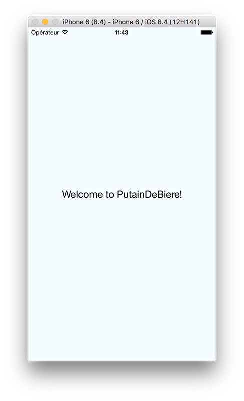
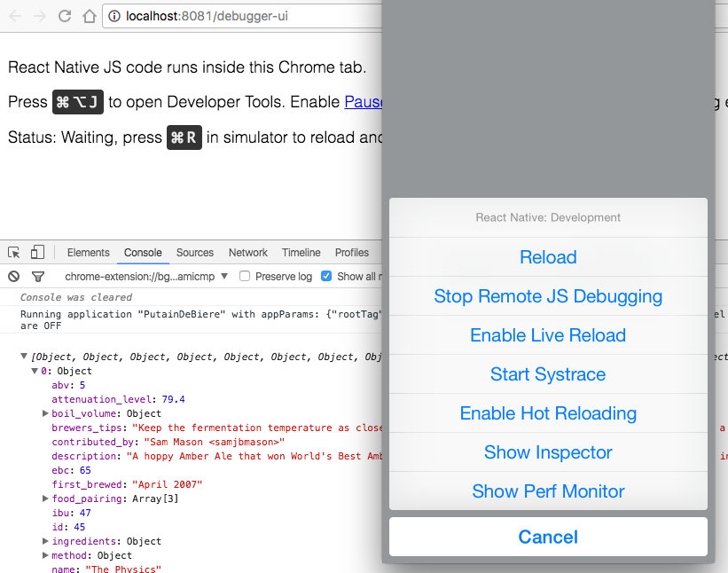

Cela fait déjà plus d'un an que Facebook a publié la première version React Native.
Longtemps considéré comme une expérimentation sympathique (après tout, il est né lors d'un hackathon), un cycle de release soutenu d'une version majeure toutes les 2 semaines a fait qu'aujourd'hui l'écosystème est suffisemment riche et stable pour déployer une app iOS et android en production.

## Quels problèmes avec les solutions hybrides ?

Des solutions pour développer une application mobile multiplateforme en JS existent déjà: je pense notamment à [Cordova](https://cordova.apache.org/) ou à son superset [Ionic](http://ionicframework.com/). Conçu autour d'une webview système (un navigateur embedded - Safari sur iOS, Chrome sur android) affiché en plein écran, vous utilisez des technologies web classiques: HTML, CSS, JS. Il est possible d'installer des plugins afin d'enrichir le moteur JavaScript avec de nouvelles APIs en plus des APIs navigateur.
Ainsi, `cordova-plugin-contacts` permet d'accéder au carnet d'adresses du smartphone, `cordova-plugin-vibration` permet de faire vibrer celui-ci, etc.

Le problème, c'est que si l'utilisation de plugins permet de faire pont avec le code natif (un message est envoyé de la partie JS à la partie Objective-C / Java, qui l'exécute de son côté et renvoit le résultat au JS), l'UI de l'application n'utilise elle pas du tout le layout natif des OS mobiles. Les performances et le look'n'feel de celle-ci seront donc équivalente à une app web, et non une app mobile.

Avec React Native, point de navigateur embedded, de HTML ou de CSS: vous devez composer vos interfaces à l'aide de composants React qui font appel au layout natif de la plateforme. Un exemple simple: `<View>` (qui est l'équivalent d'une `<div>` HTML) communique via un pont JS <-> Objective-C / Java pour contrôler une UIView (sur iOS) ou une android.view. Les performances de l'UI sont donc quasi similaires aux performances natives.

## Découverte de l'environnement de dev

Fatigués par JavaScript et son tooling un peu trop fourni ? Rassurez-vous: vous n'avez strictement rien à configurer pour commencer à utiliser React Native. Vous disposez out-of-the-box d'un packager Babel et d'un [preset custom](https://github.com/facebook/react-native/tree/master/babel-preset) qui intègre les fonctionnalités de ES2015, mais également le support de React / JSX (encore heureux), de [Flow](https://flowtype.org/) et d'autres helpers bienvenus telles que `async / await`.

En bons passionnés de bière, nous allons réaliser ensemble une app qui requête la [PunkAPI](https://punkapi.com/) (faites la demande d'une clé API via le formulaire prévu à cet effet).

Je vous renvoie à la [documentation officielle](https://facebook.github.io/react-native/docs/getting-started.html) pour ce qui est de l'installation des dépendances (celles-ci variant selon votre OS et l'OS cible).
Xcode / Android studio, node et watchman étant installés, ouvrez un terminal et initiez le projet:
```
npm install -g react-native-cli
react-native init PutainDeBiere
```

Une fois le projet initialisé, le CLI vous informe de la façon dont lancer votre application: faites le dans la foulée. En ce qui me concerne, je développe pour iOS.

```bash
react-native run-ios
```

Selon votre plateforme cible, ouvrez `index.ios.js` ou `index.android.js` dans votre éditeur préféré. Modifiez quelque peu le texte et rafraichissez votre app via `Command⌘ + R`, deux pressions sur la touche `R` (emulateur android).

```javascript
/* @flow */

import React, { Component } from 'react'
import {
  AppRegistry,
  StyleSheet,
  Text,
  View
} from 'react-native'

class App extends Component {
  render() {
    return (
      <View style={styles.container}>
        <Text style={styles.welcome}>
          Welcome to PutainDeBiere!
        </Text>
      </View>
    )
  }
}

const styles = StyleSheet.create({
  container: {
    flex: 1,
    justifyContent: 'center',
    alignItems: 'center',
    backgroundColor: '#F5FCFF',
  },
  welcome: {
    fontSize: 20,
    textAlign: 'center',
    margin: 10,
  },
})

AppRegistry.registerComponent('PutainDeBiere', () => App)
```

<figure>
  
  <figcaption>Une bien jolie première étape</figcaption>
</figure>

## Récupération des données

Afin de requêter notre API, React Native nous offre plusieurs plusieurs solutions: `fetch()` ou `XMLHttpRequest`. Tenez vous en **uniquement** à l'utilisation de la première, la deuxième n'étant présente que pour assurer une compatibilité avec des librairies tierces.

*/!\ Notre clé API doit être encodé en base64. La function `btoa()` n'étant pas disponible en React Native, il est nécessaire d'installer une dépendance.*

```bash
npm install --save base-64
```

Histoire de séparer notre logique API de nos composants React, nous allons créer un fichier nommé `punkapi.js` à la racine de notre projet.

```javascript
import base64 from 'base-64' // importez la dépendance tout juste installée

const rootEndpoint = 'https://punkapi.com/api/v1'
// pour simplifier la compréhension de ce tuto, nous renseignons la clé API "en dur"
// ne faites jamais cela au sein de vos projets (voir http://12factor.net/fr/config)
const punkApiKey = 'xxxxxxxxxxxxxxxxxxxxxxxxxxxxxxxx'
const password = '' // la punk API n'utilise aucun mot de passe
const authBase64 = base64.encode(`${punkApiKey}:${password}`)

const headers = {
  'Content-Type': 'application/json',
  'Accept': 'application/json',
  'Authorization': `Basic ${authBase64}` // HTTP basic auth
}

// retourne une recette de bière au hasard
export const getRandomBrewdog = () =>
  fetch(`${rootEndpoint}/beers/random`, { headers })
    .then(response => response.json()) // on parse la réponse en JSON
```

Nous allons maintenant modifier notre composant `<App>` afin de faire une requête simple d'une bière au hasard juste avant le montage de celui-ci.

```javascript
import { getRandomBrewdog } from './punkapi'

class App extends Component {
  componentWillMount() {
    getRandomBrewdog() // fetch() retourne une Promise
      .then(json => console.log(json))
      .catch(error => console.error(error))
  }

  …
}
```

Vous apercevez la présence d'un appel à `console.log()`. Pour y accéder, rien de plus simple: pressez `Command⌘ + D` au sein de l'émulateur iOS, ou appuyez sur le bouton `Menu` de l'émulateur android. Celui-ci contient de multiples choses que je vous laisse expérimenter par la suite; ce qui nous intéresse ici c'est le bouton `Debug JS Remotely`, qui va ouvrir un nouvel onglet dans Chrome ou sera exécuté notre code JS.

Il devient donc possible d'ouvrir les Chrome Devtools (dont la console) afin de débuguer notre app.

<figure>
  
  <figcaption>Jusqu'ici tout va bien</figcaption>
</figure>
