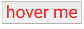

Il existe de nombreuses approches et [solutions différentes](https://github.com/MicheleBertoli/css-in-js) pour gérer le CSS en ReactJS, je vais parler ici de [styled-components](https://github.com/styled-components/styled-components) qui permet de gagner en productivité et en qualité quand on veut créer et distribuer des composants UI.

La force de [styled-components](https://github.com/styled-components/styled-components) c'est de faciliter la création de composants visuels ReactJS minimalistes et configurables, en combinant du **CSS standard** et **un zeste de JavaScript**. Ces composants deviendront littéralement les pièces de lego qui pourront être utilisées et partagées entre les UIs de toutes vos applications, sites webs...

Si vous voulez jouer avec, je vous conseille d'utiliser [create-react-app](https://github.com/facebookincubator/create-react-app) pour générer un projet vierge puis d'ajouter styled-components au projet : `npm i --save styled-components`.

Avec styled, on peut abstraire le CSS et le DOM de la vue, ce qui va grandement simplifier le code de la partie "métier" de l'application, et améliorer la lisibilité.

##### Avant :

```jsx
// solution en pure CSS-in-JS

const styles = {
  box: {
    width: '60%',
    border: '1px solid silver'
  },
  title: {
    fontSize: '1.2em',
    fontWeight: 'bold'
  },
  description: {
    fontSize: '0.8em'
  },
  important: {
    fontWeight: 'bold'
  }
}

// nos composants intègrent les styles dans le code
<div className={ styles.box }>
  <div className={ styles.title }>{ title }</div>
  <div className={ classnames(styles.description, styled.important) }>{ description }</div>
</div>
```

##### Après :

```jsx
// avec styled-components

const Box = styled.div`
  width: 60%;
  border: 1px solid silver;
`

const Title = styled.div`
  font-size: 1.2em;
  font-weight: bold;
`

const Description = styled.div`
  font-size: 0.8em;
  font-weight: ${ props => props.important ? 'bold' : 'normal '}
`

// les composants sont pré-stylés, pas de bruit généré par le styling
<Box>
  <Title>{ title }</Title>
  <Description important>{ description }</Description>
</Box>
```

### Avantages :
 - [community powered](https://github.com/styled-components/styled-components/graphs/contributors) - moving fast, [v2 en cours](https://github.com/styled-components/styled-components/tree/v2)
 - support des [thèmes](https://github.com/styled-components/styled-components/blob/master/docs/theming.md)
 - [syntaxe CSS "classique"](https://github.com/styled-components/styled-components/blob/master/docs/css-we-support.md) mais scopé automatiquement
 - Gestion des media queries, pseudo-selectors, nesting
 - Un [autoprefixer-like intégré](https://github.com/rofrischmann/inline-style-prefixer/)
 - Code "métier" plus lisible
 - Compatible react-native
 - Compatible avec les [snapshots Jest](https://facebook.github.io/jest/) out of the box
 - Ne nécessite pas de loader Webpack spécifique ❤️

### Inconvénients :
 - pas encore idéal pour [des styles très dynamiques](https://github.com/styled-components/styled-components/issues/134)
 - pas encore idéal pour [le server-side](https://github.com/styled-components/styled-components/issues/124)
 - syntaxe pas forcement bien [surlignée ou lintée](https://github.com/styled-components/styled-components#linting) mais [des plugins existent](https://github.com/styled-components/styled-components#syntax-highlighting).


### Fonctionnement

Techniquement, [styled-components](https://github.com/styled-components/styled-components) va pour chaque composant "styled" présent dans le DOM :

 - injecter les classes CSS nécessaires pour ce composant dans le `<head>` de la page, au runtime.
 - fournir au composant une props `className` unique (ainsi que ses `ownProps`)

La syntaxe est certes exotique, le CSS étant défini dans un template-string ES2015, mais ceci rend le code très concis.

Pour en savoir plus sur les "Template Strings", ou "Littéraux de gabarits" en Français 🇫🇷 vous pouvez lire [l'excellente doc chez MDN](https://developer.mozilla.org/fr/docs/Web/JavaScript/Reference/Litt%C3%A9raux_gabarits).

### Usage :

```jsx
import styled from 'styled-components'

// exemple ici avec une div
const Title = styled.div`
  font-size: 3rem;
  color: #ff3333;
`

// utilisable comme ceci :
<Title>Hello, World</Title>
```

ceci qui génèrera automatiquement dans le DOM:

```html
<div class="dxhUOh">Hello, World</div>
```

et injectera dans le CSS de la page le style associé :

```css
.dxhUOh {
  font-size: 3rem;
  color: #ff3333;
}
```


## Exemples

### Composition

Les composants styled sont des composants ReactJS standards qui peuvent recevoir des `children` et se composer les uns avec les autres.

```jsx
const Box = styled.div`
  border: 1px solid silver;
  width: 80%;
  padding: 1em;
  text-align: center;
  background: #e7f3ff;
`

const Title = styled.div`
  font-size: 1.5em;
  color: #0080ff;
`

<Box>
  <Title>Hello, World</Title>
</Box>
```


### Etendre des composants en CSS

Surcharger un composant avec du CSS :

```jsx
const Title = styled.div`
  font-size: 3rem;
  color: #ff3333;
`
const BlueTitle = styled(Title)`
  color: #0080ff;
`
<Title>titre en rouge</Title>
<BlueTitle>titre en bleu</BlueTitle>
```


### Pseudo classes

Les pseudo-classes, le nesting sont acceptées

```jsx
const Button = styled.button`
  font-size: 3rem;
  color: #ff3333;
  &:hover {
    color: #0080ff;
  }
`
```



### Media queries

Les medias queries sont possibles facilement :

```jsx
const Cover = styled.div`
  background-image: url(http://putaindecode.io/assets/npm.png);
  background-repeat: no-repeat;
  background-size: contain;
  background-position: center center;
  width: 800px;
  height:300px;

  @media (max-width: 800px) {
    width: 400px;
  }
`
```

Usage avancé des media queries : https://github.com/styled-components/styled-components/blob/master/docs/tips-and-tricks.md#media-templates

### Composants configurables

Mieux : comme le composant à directement accès aux `props` (attributs du composant), on peut le configurer depuis le JavaScript :

```jsx
const Title = styled.div`
  font-size: 3rem;
  color: ${props => props.blue ? '#0080ff' : '#ff3333'};
`
<Title>titre en rouge</Title>
<Title blue>titre en bleu</Title>
```


### Dans un composant React "classique"

Avec la methode `styled.css`, une `className` unique est générée et peut être utilisée pour vos composants :

```jsx
import Notification from './Notification'

const warning = styled.css`
  color: #ff3333;
`

const WarningNotification = () => <Notification className={ warning } />
```

### Réutiliser des styles

Comme styled utilise des [templates literals](https://developer.mozilla.org/fr/docs/Web/JavaScript/Reference/Litt%C3%A9raux_gabarits) vous pouvez utiliser n'importe quelle variable dans votre CSS :

```jsx
const textStyle = `
  font-size: 2em;
  letter-spacing: 5px;
`
const TextRed = styled.div`
  ${textStyle}
  color: #ff3333;
`
const TextBlue = styled.div`
  ${textStyle}
  color: #0080ff;
`
<TextRed>texte en rouge</TextRed>
<TextBlue>texte en bleu</TextBlue>
```


### Attributs HTML

Par défaut les composants styled passent toutes leur `props` au DOM, par exemple ici, `placeholder`.

```jsx

const SuperInput = styled.input`
  border: 2px solid silver;
  border-radius: 2px;
  text-align: center;
  font-size: 1.5em;
`

<SuperInput placeholder="Your name"/>
```


### Utiliser le theming

Pour rendre son UI themable, il suffit d'encapsuler son App dans un composant `ThemeProvider`; Chaque composant styled se verra alors fournir une props `theme` avec toutes les variables du thème :

```jsx

const Button = styled.button`
  background: ${props => props.theme.main || 'silver'};
`

// Create a green theme
const greenTheme = {
  main: 'mediumseagreen',
}

// Create a blue theme
const blueTheme = {
  main: '#0080ff',
}

<ThemeProvider theme={greenTheme}>
  <Button>I'm green!</Button>
</ThemeProvider>
```

Et pour aller loin, consultez la [documentation officielle](https://github.com/styled-components/styled-components/blob/master/docs/theming.md#using-theming)

### Injecter des CSS globaux

Parfois on a besoin d'intégrer aussi du CSS "global". Par exemple pour les fontes, ou lorsque l'on migre une grosse application.

Voici une façon de le faire avec styled :

```js
import { injectGlobal } from 'styled-components'

injectGlobal`
  @import url('https://fonts.googleapis.com/css?family=Roboto');
  * {
    font-family: 'Roboto', sans-serif;
  }
`
```

Plus d'infos sur [la doc d'injectGlobal](https://github.com/styled-components/styled-components/blob/master/docs/api.md#injectglobal)

### React Storybook

En ajoutant [react-storybook](https://github.com/storybooks/react-storybook) dans votre projet, vous pourrez facilement vous constituter une bibliothèque visuelles avec vos propres composants, hors contexte, dans tous leurs etats possibles, et avec du Hot-Reload ce qui est **très très pratique dans la phase de conception**.

### Autres liens :

 - [Documentation officielle](https://github.com/styled-components/styled-components/blob/master/docs)
 - [Enforcing Best Practices In Component-Based Systems](https://www.smashingmagazine.com/2017/01/styled-components-enforcing-best-practices-component-based-systems/)
 - [The magic behind 💅 styled-components](http://mxstbr.blog/2016/11/styled-components-magic-explained/)
 - [React CSS-in-JS techniques comparison](https://github.com/MicheleBertoli/css-in-js)
