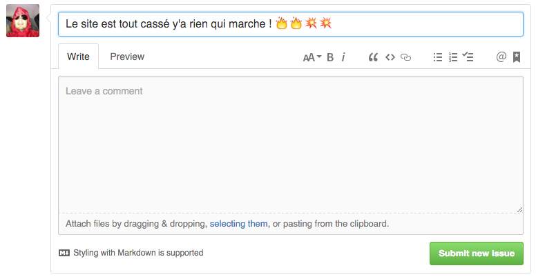
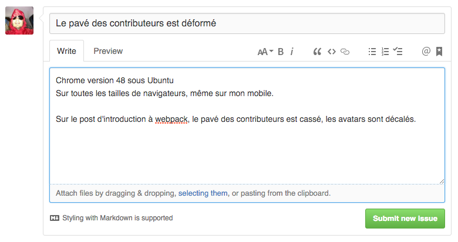

_Note: Vous devez avoir avoir un compte GitHub._

## Soumettre un rapport de bug

Pas de panique ! Pour nous le signaler, il suffit simplement de remplir
[le formulaire de rapport de bug](https://github.com/putaindecode/putaindecode.io/issues/new).

Selon la nature du bug, pensez à nous fournir les informations nécessaires pour
le reproduire comme par exemple :

- Le nom et la version de votre navigateur web avec votre système d'exploitation
  (ex: Internet Explorer 6.0 sous Windows 98),
- La taille de votre navigateur web
  (ex: super grand, super petit),
- La date et l'heure à laquelle vous avez reproduit ce bug et vos conditions physiques
  (ex: 3h du matin, 4g de sang par litre d'alcool).

Vous pouvez aussi fournir un screenshot si vous pensez que c'est pertinent.

## Exemples

### Un mauvais rapport de bug

### Un bon rapport de bug

